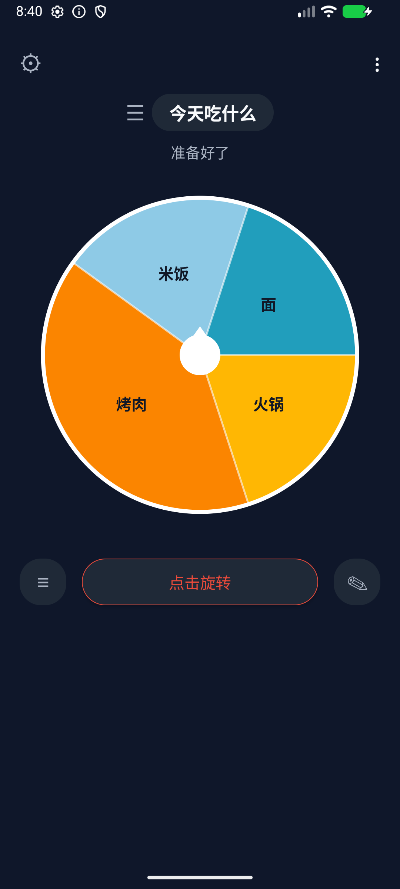
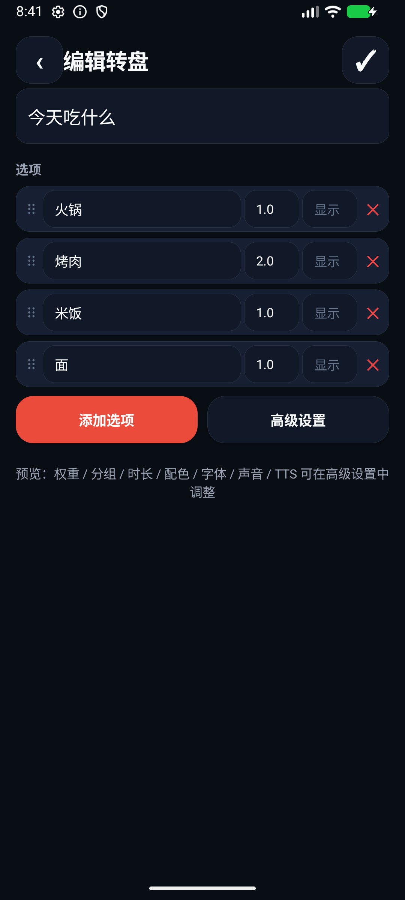

# Wonderful Wheel

为剧情创作设计的 Android 转盘应用。

> 核心功能：**真实权重与显示权重分离**。扇区展示大小可以与实际抽选概率不同，适合剧情向二创、直播和录播。

## 界面

<p align="center">
  
  
</p>

## 功能

- **真实权重与显示权重**：真实权重控制抽选概率，显示权重只控制扇区大小；显示权重留空时与真实权重一致。
- **旋转动画**：带缓动曲线，旋转时长 1–30 秒可调。
- **音效反馈**：经过选项时播放提示音，选中后播放确认音。
- **系统 TTS**：选中后自动语音播报结果。
- **自定义显示**：支持多种配色、字体大小和文字布局设置。
- **转盘管理**：支持嵌套分组、搜索、编辑和选项拖动排序。
- **导入与导出**：支持社区 PWH 格式和完整保留应用数据的 WWD 格式；Android 可从文件应用直接打开或分享单个 `.pwh` 文件。
- **抽取历史**：按当前转盘查看自然完成的抽取，可清空当前转盘历史；终止或复位不会产生记录。
- **本地存储**：数据保存在应用私有存储中，无需网络和存储权限。

## 构建

需要 JDK 17 或更高版本，以及包含 Android SDK 36 的 Android SDK 环境。

```bash
./gradlew :app:assembleDebug
```

生成的安装包位于：

```text
app/build/outputs/apk/debug/app-debug.apk
```

## 安装与运行

连接 Android 设备或启动模拟器后执行：

```bash
adb install -r app/build/outputs/apk/debug/app-debug.apk
adb shell am start -n com.wheel.app/com.wheel.app.android.MainActivity
```

运行本地单元测试：

```bash
./gradlew :app:testDebugUnitTest
```

## 选项输入格式

新建或编辑转盘时，每行一个选项：

```
名字,真权重,假权重
```

假权重可留空：

```
起床,1,10
出门,3,
探索,2,5
战斗,4,
```

## PWH 格式

文件结构：`pwh` (3 字节) + gzip(JSON)。导入时支持的 JSON 结构：

```json
{
  "exportTime": 1783770433840,
  "version": 5,
  "wheels": [
    {
      "dbId": 1,
      "items": [
        {"text": "选项 A"},
        {"text": "选项 B", "weight": 12}
      ],
      "title": "示例转盘"
    }
  ]
}
```

PWH 导出会舍弃分组、假权重等该格式不支持的数据。Android 支持从系统“打开方式”或分享面板接收单个 `.pwh` 文件；文件名和 `pwh` 内容头都会被校验，不支持多文件分享。

## WWD 格式

标准导出文件名为 `export.wwd`，内部仍是可直接查看的 UTF-8 JSON，不会隐藏内容；旧的 `.wwd.json` 文件仍可导入。协议也支持 `wwd` + gzip(JSON) 的压缩表示。完整包含：
- 分组结构和嵌套子分组
- 每个转盘的设置（配色、旋转时长、音效开关、字体大小）
- 所有选项的真权重和假权重
- 抽取历史快照（按当前转盘展示；删除转盘后记录仍会保留在 WWD 中）
